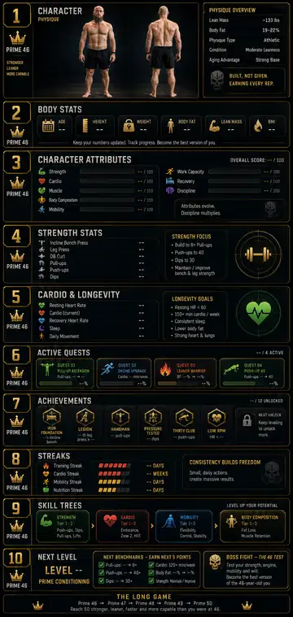

# PRIME 46 — GRAPHICS REFERENCE STANDARD v0.1

**Status:** WORKING — OWNER-APPROVED VISUAL DIRECTION  
**Owner:** Don Murphin  
**Date:** 2026-10-07  
**Purpose:** Establish the current baseline visual standard for PRIME 46 graphics and screen design without changing LOCKED product/gameplay canon.

## Reference board

- **Source:** Owner-provided composite dashboard reference, supplied 2026-10-07.
- **Original source dimensions:** 864 × 1821 PNG.
- **Repository copy:** Optimized WebP reference copy for lightweight repository review.
- **Source share:** https://chatgpt.com/s/m_6ac5edc214508191bd564bcee30b79ba
- **Important:** This artwork is a **composite visual-direction board**, not a literal single application screen.

## Required visual direction

Use this board as the minimum visual-quality and art-direction baseline for future PRIME 46 graphics:

- Near-black / charcoal surfaces with restrained texture and strong contrast.
- PRIME gold as the unifying structural color for frames, hierarchy, section numbers, crowns, key labels, progress emphasis, and premium accents.
- Premium industrial / tactical game-HUD character rather than a generic fitness-app dashboard.
- Bold, condensed, uppercase display typography for major headings, with readable supporting type for metrics and explanations.
- Modular framed cards with strong visual hierarchy and deliberate spacing.
- Crown / PRIME 46 identity used as a recognizable system mark without turning every element into branding clutter.
- Selective semantic accent colors for categories such as Strength, Cardio, Mobility, Body Composition, Recovery, and similar systems while gold remains the visual spine.
- Progression should feel like a game: Quests, Achievements, Streaks, Skill Trees, Levels, Benchmarks, and Boss Fights should have distinct visual identity.
- Character / physique presentation should feel aspirational and cinematic rather than like stock fitness photography placed inside a dashboard.
- Information can be dense, but every mobile screen must remain readable, fast to scan, and usable one-handed.
- PRIME language and identity should feel earned and disciplined: **BUILT. NOT GIVEN.**

## Screen-breakdown rule

The supplied artwork **must not be implemented as one long screen merely because the reference is one long image**.

It is a visual system board that will be broken into multiple mobile-first screens, panels, and states. The reference currently demonstrates visual treatments for areas including:

- Character / Physique
- Body Stats
- Character Attributes
- Strength Stats
- Cardio & Longevity
- Active Quests
- Achievements
- Streaks
- Skill Trees
- Next Level / Benchmarks
- Boss Fight

Exact screen grouping remains subordinate to PRIME's LOCKED navigation and approved product architecture.

## Mobile implementation standard

When translating this direction into the application:

1. Preserve the visual language and premium game feel.
2. Reduce information per screen instead of shrinking everything to fit.
3. Keep primary actions and current state dominant.
4. Use progressive disclosure for secondary statistics and explanation.
5. Maintain touch-friendly controls, readable metric sizes, and clear scanning order at phone widths.
6. Treat desktop as an expansion of the mobile hierarchy, not the source layout.

## Canon boundary

This reference establishes **visual direction only**. It does **not** authorize changes to LOCKED PRIME 46 product meaning.

Specifically, the reference does not override:

- `PRODUCT_BIBLE.md`
- LOCKED assessment or scoring contracts
- PLAY · CHARACTER · TRAINING · PROGRESS navigation
- Assessment → Training → Progress evidence semantics
- Quest, Boss, XP, Capability, Progress, or Recommendation Engine meaning
- Mobile-first requirements
- Any other LOCKED product decision

Numbers, labels, body metrics, targets, scores, achievements, and other content visible inside the artwork are **illustrative unless independently supported by canonical PRIME data and rules**. The artwork must never be used as evidence for physiological claims or player-state values.

If this visual reference conflicts with LOCKED canon, **canon wins**.

## Repository handling

This standard and its reference imagery are design-source material. The `design/` directory is excluded from Cloudflare static production assets through `.assetsignore`.

---

**Direction:** Keep the power, hierarchy, darkness, gold, progression, and game identity of this board. Break it into real PRIME 46 screens instead of flattening it into one dashboard.
